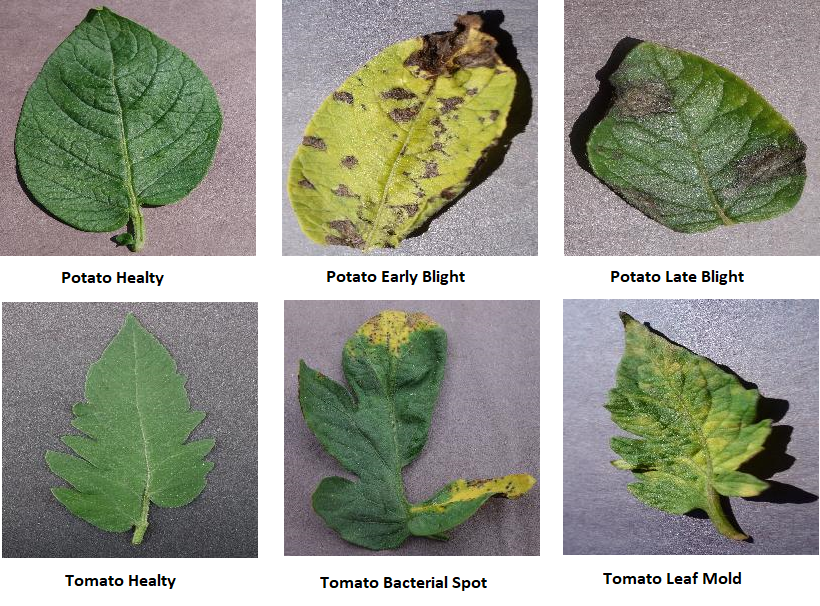
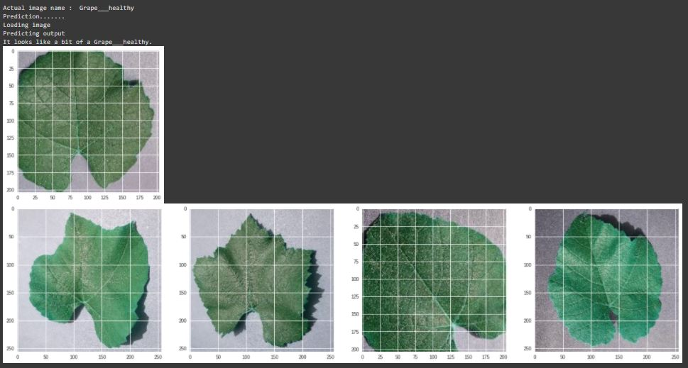
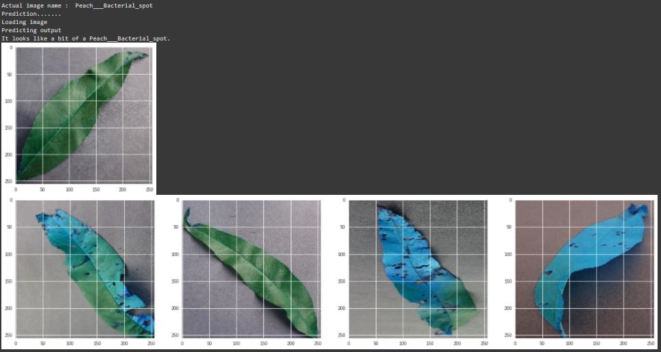

# Plant-Leaf-Disease-Image-Classification-using-CNN

 

## Business Objectives :

Crop diseases are a major threat to food security, but their rapid identification remains difficult in many parts of the world due to the lack of the necessary infrastructure. The combination of increasing global smartphone penetration and recent advances in computer vision made possible by deep learning has paved the way for disease diagnosis. Every disease, pest, and deficiency leaves behind a specific pattern. 

The objective of this project is to apply ML/DL Algorithms to identify the plant leaf diseases for an input image.

## Data Collection :

We have used the plant village dataset. The PlantVillage dataset consists of 61,486 healthy and unhealthy leaf images divided into 39 categories by species and disease. The data in form of images was provided by:

Link: https://data.mendeley.com/datasets/tywbtsjrjv/1

## Modelling :

The following modelling approach was used in the project:

1. Load XceptionNet pre-trained model
2. Customize and fine-tune the pre-trained model
3. Train to clasify the images.

The detailed analysis and model creation can be found in the .ipynb file. 

## Result :

Some of the test images are given below.

The results from Classical ML Models are as below:

## Conclusion :

In this project we used various pre-trained model for the development of an app for the identification of various plant leaf disease, and we achieved our best results with the application of a transfer learning model. We achieved an validation accuracy of 75% in our tests using XceptionNet Model. 

However, we still see several options to further improve our algorithm in the future:
  1. We could gather more training data as due to compatational capacity, we just used 20% of it.
  2. We could add more layers to make our model more complex and hopefully more powerful.
  3. We could extend our training time and add more epochs to the training.

But all in all, the accuracy levels from our tests, along with the tests with specific sample images, suggest that we already have a serious model we could work with in a real app.
